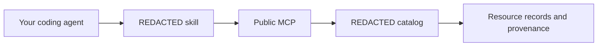

<p align="center">
  
</p>

<h1 align="center">REDACTED Crypto Resources</h1>

<p align="center">A portable agent skill for finding Web3 developer tools in REDACTED's public MCP catalog.</p>

<p align="center">
  <a href="https://askredacted.xyz/developers/skill"></a>
  <a href="https://askredacted.xyz/developers/mcp"></a>
  <a href="https://askredacted.xyz/downloads/redacted-crypto-resources.zip"></a>
</p>

## Quick start

Install the skill into a supported coding agent:

```sh
npx skills add askredacted/crypto-resources
```

Then connect the public MCP. For Codex:

```sh
codex mcp add redacted-crypto-resources --url https://askredacted.xyz/mcp
```

For Claude Code:

```sh
claude mcp add --transport http redacted-crypto-resources https://askredacted.xyz/mcp
```

Other clients can add `https://askredacted.xyz/mcp` as a remote Streamable HTTP server. No REDACTED account or API key is required. See the [MCP guide](https://askredacted.xyz/developers/mcp) for client-independent setup.

## Catalog

REDACTED's public MCP catalog helps agents discover Web3 developer tools by capability and category. Records include descriptions, categories, resource links, and provenance. Separate REDACTED model and API entries are marked as previews. Use `get_catalog_overview` for current coverage and `get_source_manifest` for source and snapshot information.

Listings can contain third-party descriptions and claims. Inclusion does not establish current chain support, pricing, security, or availability; verify those details with the provider before building on a tool.



## Try it

> Use the redacted-crypto-resources skill to find wallet and RPC tools for a Solana app. Read full listings, identify what still needs verification, and cite the resource links returned by the catalog.

The skill guides search, category browsing, source checks, and focused recommendations. It does not bundle the catalog; the MCP connection supplies the data.

## Portability

`SKILL.md` follows the open [Agent Skills format](https://agentskills.io/specification). `agents/openai.yaml` adds optional display text and a suggested prompt for OpenAI clients; other agents can ignore it. MCP setup is separate for every client.

## Update and inspect

Run the install command again to update. Review [SKILL.md](SKILL.md) before installing, or use the [direct ZIP download](https://askredacted.xyz/downloads/redacted-crypto-resources.zip). The ZIP also works with `npx skills add` using its full URL.
